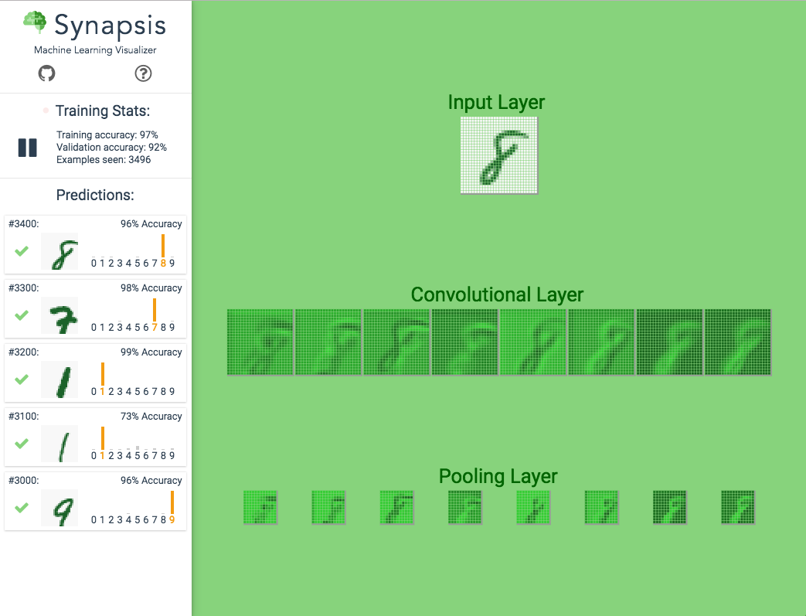

# Synapsis

[Link to Synapsis](https://synapsis-app.herokuapp.com/#/)

### Background
Machine learning and neural networks are topics that seem daunting from a layman's point of view. Synapsis aims to demystify these topics by showing what machine learning & neural networks are capable of followed by a walkthrough of what is going on behind the scenes.

### Overview of the App
In Synapsis, a convoluted neural network will be trained live to recognize handwritten digits from 0-9. The neural network starts off with low prediction accuracy rates. As training continues, the neural network becomes more accurate and is able to achieve a 99% accuracy rate within a few minutes.



## Features

### Neural Network Layers
The visualization shows a summarized layout of the convolutional neural network. The visualization shows the input layer, 2 convolutional layers, 2 pool layers, a softmax layer, and a fully connected layer. Each neuron in the layers are represented by a pixel block. Each neuron’s connections (aka synapses) are shown when a neuron is hovered over.

### Training Stats
Live training stats are displayed on the sidebar. These stats are emitted from the neural network after each prediction. The data is posted to the visualization components by making use of the web worker `postMessage()` method.
```js
// /src/synapsis/mnist_neural_network.js

emit() {
   this.post({
     type: 'STATS',
     message: {
       valAcc: this.valAccWindow.get_average(),
       trainAcc: this.trainAccWindow.get_average(),
       examples: this.step_num
     }
   });
 }
```

### Predictions
Every 100th prediction is displayed. An indicator shows if the neural network’s top guess is correct or incorrect. A histogram also shows the distribution of each number’s prediction relative to the top prediction.

## Implementation

##### ConvNetJS
- ConvNetJS is a powerful JavaScript library that removes a lot of the legwork required to set up a convolutional neural network.
##### Web Worker
- A SharedWorker is used to run the convolutional neural network. This moves the computational load of training the neural network into a background thread. Moving the computations to a background thread is essential to have a responsive visualization. The SharedWorker ports data to the Vue app every 100 examples.
##### Vue.js
- Vue is used for data binding and inexpensive virtual DOM re-rendering. Data coming from the background thread is stored in the top level component. The visualization data then flows unidirectionally to the child components.
##### HTML5 Canvas
- HTML5 canvas is used in multiple ways for this app. Canvas is used to convert raw image data into a format (Uint8ClampedArray) that is parseable by the neural network built in JavaScript. Canvas is also used to draw out each image in the visualization.
## Additional Features
Features that will be added to this visualization includes:
##### User Handwriting Recognition
- At one point during the live training, a blank canvas can be pulled up. The user can draw their own number on the canvas and feed it into the neural network. The neural network will then process the input from the user and output its prediction.
##### Simple Artificial Neural Network
- On a separate page, a much more simple neural network will be trained live.. This visualization will show forward propagation, back propagation, gradient descent, and all of the other fine details of what is going on behind the scenes.
